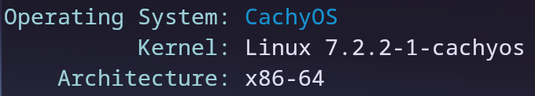
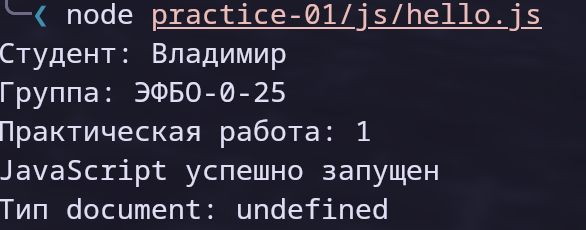
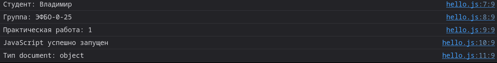
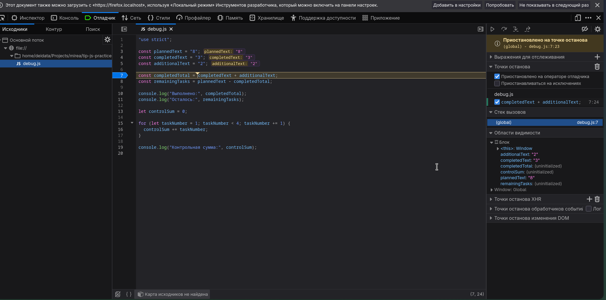

# Отчет по первой практике

## 1. Автор и вариант

Автор: Кузнецов Владимир Николаевич
Группа: ЭФБО-05-25
Номер варианта: -

## 2. Окружение

Операционная система: CachyOS  
  
Версия Node.js: `v26.8.1`  
Версия npm: `12.0.2`  
Версия Git: `2.55.0`  
Используемый браузер: Zen Browser  

## 3. Запуск

### Node.js

Все команды выполняются из корня репозитория `tip-js-practices`:

```bash
node practice-01/js/hello.js
node practice-01/js/types.js
node practice-01/js/progress.js
node practice-01/js/plan.js
node practice-01/js/debug.js
```

### Браузер

1. Открыть файл `practice-01/index.html` в браузере как локальный файл.
2. Открыть DevTools (`F12` или `Ctrl+Shift+I`) → вкладка **Console**.
3. Для проверки другого задания заменить путь в теге `script` в `index.html`,
   например `./js/hello.js` → `./js/types.js`.
4. Сохранить `index.html` и перезагрузить страницу (`F5`).

Одновременно подключается только один учебный файл, так как в файлах могут
повторяться имена переменных верхнего уровня. Результат выводится только в Console,
на самой странице отображается лишь заголовок.

## 4. Задание 1  

Запуск через терминал командой `node practice-01/js/hello.js`:  
  

Запуск в браузере:  
  

`console.log("Тип document:", typeof document);` - выводит разный результат, при разных запусках. Когда запускаем в Node.js мы запускаем сам файл JS, там нету DOM, следователься объект document не создается. А при запуске в браузере, он сам создает document. Поэтому результат `typeof document` отличается.  

## 5. Задание 2  

| № | Выражение | Ожидание до запуска | Фактическое значение | Тип результата | Объяснение |
|---:|---|---|---|---|---|
| 1 | `"8" + 2` | `"82"` | `"82"` | string | Если один из операндов `+` - строка, то выполняется конкатенация, число `2` преобразуется в строку `"2"`. |
| 2 | `"8" - 2` | `6` | `6` | number | `-` не работает со строками, поэтому `"8"` неявно преобразуется в число. |
| 3 | `Number("8") + 2` | `10` | `10` | number | Явное преобразование строки в число, затем обычное сложение двух чисел. |
| 4 | `"12" > "3"` | `true` | `false` | boolean | Обе стороны строки, поэтому сравниваются символы|
| 5 | `12 === "12"` | `false` | `false` | boolean | Строгое равенство не преобразует типы, number и string не равны. |
| 6 | `Number("")` | `NaN` | `0` | number | Пустая строка преобразуется в `0`.|
| 7 | `Number("text")` | `NaN` | `NaN` | number | Строку нельзя разобрать как число.|
| 8 | `Boolean("false")` | `false` | `true` | boolean | Любая непустая строка истинна, содержимое не анализируется.|
| 9 | `typeof null` | `"object"` | `"object"` | string | Историческая особенность языка `typeof null` возвращает `"object"`.|
| 10 | `typeof NaN` | `"number"` | `"number"` | string | NaN - специальное значение числового типа.|


## 6. Задания 3 и 4  

### Задание 3

| Проверка | Входные данные (total, completed) | Ожидаемый результат | Фактический результат | Итог |
|---|---|---|---|---|
| Свой вариант (7) | 10, 7 | Осталось 3; 70.0%; «В работе» | Всего задач: 10; Выполнено: 7; Осталось: 3; Прогресс: 70.0%; Статус: В работе | Пройдено |
| Обычный случай | 12, 5 | Осталось 7; 41.7%; «В работе» | Всего задач: 12; Выполнено: 5; Осталось: 7; Прогресс: 41.7%; Статус: В работе | Пройдено |
| Граничный: нет задач | 0, 0 | «Задач пока нет», без процента | Задач пока нет | Пройдено |
| Граничный: ничего не выполнено | 5, 0 | Осталось 5; 0.0%; «Не начато» | Всего задач: 5; Выполнено: 0; Осталось: 5; Прогресс: 0.0%; Статус: Не начато | Пройдено |
| Граничный: всё выполнено | 5, 5 | Осталось 0; 100.0%; «Завершено» | Всего задач: 5; Выполнено: 5; Осталось: 0; Прогресс: 100.0%; Статус: Завершено | Пройдено |
| Некорректные: выполнено больше, чем есть | 5, 6 | Ошибка | Ошибка: выполнено больше, чем существует. | Пройдено |
| Некорректные: отрицательное число | -1, 0 | Ошибка | Ошибка: отрицательное количество. | Пройдено |
| Некорректные: дробное число | 5, 2.5 | Ошибка | Ошибка: дробное количество. | Пройдено |
| Некорректные: строка | "5", 2 | Ошибка | Ошибка: вместо числа передана строка или другой тип. | Пройдено |
| Некорректные: выше границы | 1001, 0 | Ошибка | Ошибка: превышена верхняя граница. | Пройдено |
| Некорректные: NaN | NaN, 0 | Ошибка | Ошибка: недопустимое числовое значение. | Пройдено |

### Задание 4

| Проверка | Входные данные (total, completed, limit) | Ожидаемый результат | Фактический результат | Итог |
|---|---|---|---|---|
| Свой вариант (7) | 10, 7, 3 | 1 день, выполнено 3 задачи | Осталось задач: 3; День 1: выполнено 3, осталось 0; Потребуется дней: 1 | Пройдено |
| Обычный случай | 12, 5, 3 | 3 дня; в последний день 1 задача | Осталось задач: 7; День 1: выполнено 3, осталось 4; День 2: выполнено 3, осталось 1; День 3: выполнено 1, осталось 0; Потребуется дней: 3 | Пройдено |
| Остаток делится нацело | 10, 4, 3 | 2 дня по 3 задачи | Осталось задач: 6; День 1: выполнено 3, осталось 3; День 2: выполнено 3, осталось 0; Потребуется дней: 2 | Пройдено |
| Норма больше остатка | 5, 3, 10 | 1 день, выполнено 2 | Осталось задач: 2; День 1: выполнено 2, осталось 0; Потребуется дней: 1 | Пройдено |
| Граничный: всё выполнено | 5, 5, 2 | 0 дней, цикл не выполняется | Все задачи уже выполнены. Потребуется дней: 0 | Пройдено |
| Граничный: нет задач | 0, 0, 2 | 0 дней, цикл не выполняется | Все задачи уже выполнены. Потребуется дней: 0 | Пройдено |
| Некорректные: норма 0 | 5, 2, 0 | Ошибка, цикл не запускается | Ошибка: дневная норма должна быть не меньше 1. | Пройдено |
| Некорректные: дробная норма | 5, 2, 1.5 | Ошибка | Ошибка: дробной дневной нормы быть не должно. | Пройдено |
| Некорректные: выполнено больше, чем есть | 5, 6, 2 | Ошибка | Ошибка: некорректное число выполненных задач. | Пройдено |
| Некорректные: норма строкой | 5, 2, "2" | Ошибка | Ошибка: вместо числа передана строка или другой тип. | Пройдено |
| Некорректные: выше границы | 5, 2, 1001 | Ошибка | Ошибка: превышена верхняя граница нормы. | Пройдено |


## 7. Отладка  

## 7. Отладка (задание 5)

Исходный вывод программы:

```text
Выполнено: 32
Осталось: -24
Контрольная сумма: 6
```

Вывод после исправления:

```text
Выполнено: 5
Осталось: 3
Контрольная сумма: 10
```



На скриншоте программа остановлена на строке вычисления `completedTotal`;
в панели видно, что `completedText` и `additionalText` - строки `"3"` и `"2"`.

| Ошибка | Что наблюдалось | Причина | Исправление | Результат после исправления |
|---|---|---|---|---|
| Обработка количества задач | `completedTotal` = `"32"` (тип string), `remainingTasks` = `-24` | Исходные значения - строки, оператор `+` склеил `"3"` и `"2"`. Затем `-` превратил `"8"` и `"32"` в числа: 8 − 32 = −24 | Явно преобразовать строки: `Number(completedText) + Number(additionalText)`, `Number(plannedText) - completedTotal` | Выполнено: 5, Осталось: 3 |
| Граница цикла | `controlSum` = 6; в отладчике цикл завершился, когда `taskNumber` стал 4, число 4 не прибавилось | Условие `taskNumber < 4` не включает 4 | Заменить условие на `taskNumber <= 4` | Контрольная сумма: 10 |


## 8. Вывод

Подготовлено окружение, освоены запуск JavaScript в Node.js и браузере, типы данных,
явное преобразование, проверка входных данных, циклы и отладка через точки останова.

Наиболее показательная ошибка - в `debug.js`: строки `"3"` и `"2"` склеились в `"32"`,
программа отработала без исключений, но с неверным результатом. Причина стала видна
только в отладчике. Вывод: данные из строк нужно преобразовывать явно.

Выполнено расширение, вариант А: обработка входных данных, поступающих строками.

